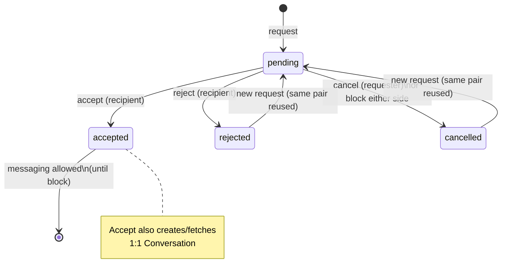

# Chat & Connections — Frontend Integration Guide

Socket.IO + REST for messaging, and the Connections (friend-request) module.

Base URL: `/api/v1`  
Socket path: default Engine.IO path `/socket.io/` on the same host as the API.

Auth for REST: `Authorization: Bearer <access_token>`  
Auth for Socket.IO handshake:

```js
io(API_HOST, {
  auth: { token: accessToken }, // also accepts auth.access_token
  transports: ["websocket", "polling"],
  reconnection: true,
});
```

Invalid/expired tokens are **rejected** (`connect` returns false). Listen for `connect:error`:

```json
{ "error_code": "INVALID_TOKEN", "message": "..." }
```

---

## 1. Socket.IO event contract

### Connection lifecycle

| Event | Direction | Payload | Notes |
|-------|-----------|---------|--------|
| `connect` | built-in | — | Server joins `user:{user_id}` + `conversation:{id}` for every conversation the user is in |
| `connect:error` | S→C | `{error_code, message}` | Emitted before reject when token is bad |
| `disconnect` | built-in | — | No DB state destroyed; presence offline emitted to conversation rooms |
| `conversation:join` | C→S | `{conversation_id}` | Join a room created after connect (e.g. after accepting a connection) |
| `presence:online` | S→C | `{user_id, conversation_id}` | To conversation room (skip sender) |
| `presence:offline` | S→C | `{user_id, conversation_id}` | On disconnect |

Heartbeat: server uses Socket.IO defaults `ping_interval=25`, `ping_timeout=60`. Do not disable client pings.

### Messaging

| Event | Direction | Payload |
|-------|-----------|---------|
| `message:send` | C→S | `{conversation_id, body_text, reply_to_message_id?}` |
| `message:new` | S→C | full `MessageResponse` (see REST shapes) |
| `message:error` | S→C (sender only) | `{error_code, message, details}` — emitted if DB write / auth fails; **never** emit `message:new` before persist |
| `message:edit` | C→S | `{message_id, body_text}` |
| `message:edited` | S→C | full `MessageResponse` |
| `message:delete` | C→S | `{message_id, scope: "for_me" \| "for_everyone"}` |
| `message:deleted` | S→C | **for_everyone:** `{message, scope}` to room; **for_me:** `{message_id, conversation_id, scope}` to sender only |
| `message:react` | C→S | `{message_id, emoji}` |
| `message:unreact` | C→S | `{message_id}` |
| `message:reaction_updated` | S→C | `{message_id, conversation_id, user_id, emoji \| null, reactions: [...]}` |

### Typing (ephemeral — no DB)

| Event | Direction | Payload |
|-------|-----------|---------|
| `typing:start` | C→S | `{conversation_id}` |
| `typing:stop` | C→S | `{conversation_id}` |
| `typing:update` | S→C | `{conversation_id, user_id, is_typing: bool}` (skip sender) |

---

## 2. REST — Chat (`/conversations`)

### `GET /conversations`

List current user's conversations (last-message preview + unread count).

**Response:** `ConversationResponse[]`

```ts
{
  id: UUID
  participants: { id, full_name, avatar_url }[]
  last_message: { id, body_text, sender_id, created_at, is_deleted } | null
  unread_count: number
  created_at: string
  updated_at: string
}
```

### `POST /conversations`

Body: `{ participant_id: UUID }` — start 1:1 (also created automatically on connection accept).

**201** `ConversationResponse` · **409** if already exists (`details.conversation_id`)

### `GET /conversations/{id}/messages`

Query:

| Param | Use |
|-------|-----|
| `cursor`, `limit` | History (newest-first cursor page) |
| `since` (ISO datetime) | Recovery after reconnect — ascending |
| `since_message_id` | Recovery after a known message id — ascending |

**Response:** `{ items: MessageResponse[], next_cursor, has_more }`

```ts
MessageResponse {
  id, conversation_id
  sender: { id, full_name, avatar_url }
  body_text                 // tombstone text if deleted for everyone
  reply_to: { id, sender_id, body_text, is_deleted } | null
  reactions: { user_id, emoji, created_at }[]
  is_deleted: boolean
  edited_at: string | null
  created_at: string
  attachment_url: null      // reserved
  attachment_type: null     // reserved
}
```

Hidden-for-me messages are excluded. Soft-deleted-for-everyone rows remain as tombstones.

### REST fallbacks (optional; sockets preferred for live)

- `POST /conversations/{id}/messages` — `{ body_text, reply_to_message_id? }`
- `PATCH /conversations/messages/{message_id}` — `{ body_text }`
- `POST /conversations/messages/{message_id}/delete` — `{ scope }`
- `POST /conversations/messages/{message_id}/reactions` — `{ emoji }`
- `DELETE /conversations/messages/{message_id}/reactions`

---

## 3. REST — Connections (`/connections`)

### Lifecycle

```
POST /connections/request          { recipient_id }
POST /connections/{id}/accept      → creates Conversation via ChatService
POST /connections/{id}/reject
POST /connections/{id}/cancel      (requester, pending only)
GET  /connections?status=pending|accepted
```

**ConnectionResponse:**

```ts
{
  id, status, created_at, responded_at
  requester: { id, full_name, avatar_url }
  recipient: { id, full_name, avatar_url }
  conversation_id: UUID | null   // set when accepted
}
```

### Blocks

```
POST   /connections/block           { user_id }
DELETE /connections/block/{user_id}
GET    /connections/blocked
```

Block side-effects (server-enforced):

1. Cancels any pending connection between the pair  
2. Blocks new connection requests either way  
3. Blocks messaging on REST **and** `message:send` (socket)  
4. Discover should filter using blocked IDs / relationship status (when Discover lands)

### Discover badge (no extra list fan-out)

```
GET /connections/relationship/{user_id}
→ { user_id, status, connection_id? }
```

`status` enum for UI:

| Value | Badge |
|-------|--------|
| `none` | **Connect** |
| `pending_outgoing` | **Pending** |
| `pending_incoming` | **Respond** (optional) |
| `connected` | **Message** |
| `blocked` | hide / blocked |
| `blocked_by_them` | hide |

When Hakeem/Discover profile responses are built later, embed the same `connection_status` field using this service so the client avoids N+1 relationship calls.

---

## 4. Recommended client reconnection strategy

```mermaid
sequenceDiagram
  participant App
  participant Socket
  participant REST

  App->>Socket: connect(auth.token)
  Socket-->>App: connect OK + presence
  Note over App: Keep lastSeenAt / lastMessageId per open conversation

  Socket--xApp: disconnect
  App->>Socket: auto-reconnect
  Socket-->>App: connect OK
  loop each open conversation
    App->>REST: GET .../messages?since=lastSeenAt&limit=50
    REST-->>App: missed messages (ASC)
    App->>App: merge by message.id (upsert; ignore dupes)
  end
  App->>Socket: conversation:join (if new conv created while offline)
```

Rules:

1. **Postgres is source of truth.** Socket events are the fast path only.  
2. On every successful `message:new` / history fetch, advance `lastSeenAt` / `lastMessageId`.  
3. Merge by `message.id` — never append blindly (reconnect + live event can race).  
4. If socket is down, allow compose via REST `POST .../messages`; still listen for socket when back.  
5. After accepting a connection, call `conversation:join` with the returned `conversation_id`.

Pagination envelope (shared with Community): `{ items, next_cursor, has_more }`.

---

## 5. Connection status state machine



Block is orthogonal: if a block exists either direction, requests and messaging are forbidden regardless of prior `accepted` status.

---

## 6. Intentionally deferred

| Feature | Schema hook left |
|---------|------------------|
| Attachments / S3 upload | `messages.attachment_url`, `messages.attachment_type` (nullable, unused) |
| Group chat UI/logic | `conversation_participants` already N-way; MVP always creates exactly 2 participants |
| Nested message threads beyond single reply | `reply_to_message_id` only (one level) |
| Redis required locally | Falls back to in-memory Socket.IO manager if `REDIS_URL` host is unreachable; Docker/production should run Redis for multi-instance |

---

## 7. Product decisions locked in this pass

1. **Reactions:** one emoji per user per message (`UNIQUE(message_id, user_id)`). Changing emoji replaces.  
2. **Delete for everyone:** soft-delete (`deleted_at` + body replaced with `"This message was deleted"`).  
3. **Delete for me:** `message_hidden_for_users` row; other party unaffected.  
4. **Edit / delete-for-everyone:** sender only (server-enforced).  
5. **Rejected/cancelled** connections can be re-requested (row reused → `pending`).  
6. Chat may be started via `POST /conversations` **or** via connection accept (both go through `ChatService`).
