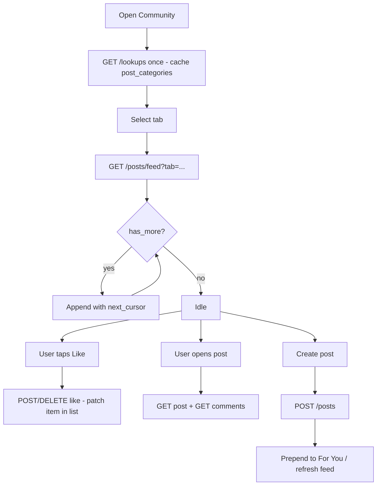

# Community Feed — Frontend Integration Guide

REST API for the Community screens: **For You / Following / Trending** tabs, post cards, create-post (Tip vs Question), likes, comments, and follow.

Base URL: `/api/v1`  
Auth: `Authorization: Bearer <access_token>` on every endpoint below.

Error envelope (all failures):

```json
{ "error_code": "STRING", "message": "Human readable", "details": null }
```

---

## 1. Screen → API map

| UI | Endpoint |
|----|----------|
| Feed tabs (For You / Following / Trending) | `GET /posts/feed?tab=...` |
| Open post + comments | `GET /posts/{id}` + `GET /posts/{id}/comments` |
| Like / unlike heart | `POST` / `DELETE /posts/{id}/like` |
| Add comment | `POST /posts/{id}/comments` |
| Create post (Tip / Question) | `POST /posts` |
| Category chips on create | `GET /lookups` → `post_categories` |
| Follow author (for Following tab) | `POST` / `DELETE /users/{user_id}/follow` |

---

## 2. Lookups — post categories

```
GET /api/v1/lookups
```

Use `post_categories` for the create-post chip row. Do **not** hardcode category keys in the app.

| key | label (display) |
|-----|-----------------|
| `ancestral_wisdom` | Ancestral Wisdom |
| `herbal_tea` | Herbal Tea |
| `skin_health` | Skin Health |
| `digestion` | Digestion |
| `mindfulness` | Mindfulness |
| `seasons` | Seasons |

```ts
type LookupItem = {
  key: string
  label: string
  description: string | null
  icon: string | null
}

// LookupsResponse.post_categories: LookupItem[]
```

When creating a post, send the **key** (e.g. `"digestion"`), not the label.

---

## 3. Feed — For You / Following / Trending

```
GET /api/v1/posts/feed?tab=for_you|following|trending&cursor=&limit=20
```

| Query | Type | Default | Notes |
|-------|------|---------|--------|
| `tab` | enum | `for_you` | `for_you` \| `following` \| `trending` |
| `cursor` | string \| omit | — | Opaque; pass `next_cursor` from previous page |
| `limit` | 1–50 | `20` | |

### Response (cursor page — same shape as chat history)

```ts
{
  items: PostResponse[]
  next_cursor: string | null
  has_more: boolean
}
```

### Tab behaviour (what the backend does)

| Tab | Ranking |
|-----|---------|
| `for_you` | Posts whose category **token-overlaps** the user’s onboarding `health_interests` score first, then `created_at` desc. No interests → recent chronological. |
| `following` | Only posts by users the current user **follows**. Empty until they follow people. |
| `trending` | Posts from the **last 7 days**, ordered by `(like_count + comment_count)` desc, then recency. |

**Tip for UI:** keep one list state per tab (or reset list + cursor when the tab changes). Do not reuse `cursor` across tabs — cursors are tab-specific.

### Infinite scroll

```ts
async function loadMore(tab: FeedTab, cursor: string | null) {
  const url = new URL("/api/v1/posts/feed", API_HOST)
  url.searchParams.set("tab", tab)
  url.searchParams.set("limit", "20")
  if (cursor) url.searchParams.set("cursor", cursor)

  const page = await api.get(url)
  // append page.items (dedupe by id if refreshing)
  return page // { items, next_cursor, has_more }
}

// stop when !has_more || next_cursor == null
```

---

## 4. Post card shape

```ts
type PostResponse = {
  id: string
  post_type: "tip" | "question"
  category: { key: string; label: string }
  body_text: string
  image_url: string | null
  like_count: number
  comment_count: number
  liked_by_me: boolean
  author: {
    id: string
    full_name: string | null
    avatar_url: string | null
    is_verified_hakeem: boolean  // always false until hakeem module ships
  }
  created_at: string  // ISO-8601
  updated_at: string
}
```

### Card field mapping

| UI element | Field |
|------------|--------|
| Author name / avatar | `author.full_name`, `author.avatar_url` |
| Verified badge | `author.is_verified_hakeem` (hide until true) |
| Category tag | `category.label` |
| Tip vs Question styling | `post_type` |
| Body | `body_text` |
| Optional image | `image_url` (null → no media) |
| Like count + filled heart | `like_count`, `liked_by_me` |
| Comment count | `comment_count` |
| Share | client-only for now (no share API yet) |

---

## 5. Create post

```
POST /api/v1/posts
Content-Type: application/json
```

```ts
{
  post_type: "tip" | "question"
  category: string      // lookup key, e.g. "skin_health"
  body_text: string     // 1–5000 chars
  image_url?: string | null  // optional; client-supplied URL for now (no S3 upload yet)
}
```

**201** → `PostResponse`

| Error | When |
|-------|------|
| `INVALID_POST_CATEGORY` 422 | `category` not in active `post_categories` |
| `INVALID_TOKEN` 401 | missing/expired auth |

### Create-flow UI notes

- **Tip vs Question** toggle → `post_type`
- Show contextual tip helper text only when `post_type === "tip"` (UI-only; backend does not store it)
- Category chips → keys from lookups
- Image: until upload exists, either omit `image_url` or pass a URL from your existing picker/CDN

---

## 6. Single post + comments

### Detail

```
GET /api/v1/posts/{post_id}
→ PostResponse
```

`POST_NOT_FOUND` 404 if missing.

### List comments (cursor)

```
GET /api/v1/posts/{post_id}/comments?cursor=&limit=20
→ { items: CommentResponse[], next_cursor, has_more }
```

Newest first. No nested replies in this pass.

```ts
type CommentResponse = {
  id: string
  post_id: string
  body_text: string
  author: { id, full_name, avatar_url, is_verified_hakeem }
  created_at: string
}
```

### Add comment

```
POST /api/v1/posts/{post_id}/comments
{ "body_text": "..." }   // 1–2000 chars
→ 201 CommentResponse
```

After success, bump local `comment_count` by 1 (or refetch the post). Server keeps a denormalized counter.

---

## 7. Like / unlike

```
POST   /api/v1/posts/{post_id}/like   → PostResponse  (liked_by_me: true, like_count updated)
DELETE /api/v1/posts/{post_id}/like   → PostResponse  (liked_by_me: false)
```

Idempotent enough for UI:

- Double-like does not double-count
- Unlike when not liked is a no-op on the counter

**Optimistic UI pattern:**

1. Flip `liked_by_me` + adjust `like_count` locally  
2. Fire request  
3. On success, replace card with response body  
4. On failure, revert  

---

## 8. Follow (powers Following tab)

```
POST   /api/v1/users/{user_id}/follow
→ 201 { follower_id, followed_id, created_at }

DELETE /api/v1/users/{user_id}/follow
→ 204
```

| Error | When |
|-------|------|
| `CANNOT_FOLLOW_SELF` 400 | following yourself |
| `ALREADY_FOLLOWING` 409 | duplicate follow |
| `NOT_FOLLOWING` 404 | unfollow when not following |
| `USER_NOT_FOUND` 404 | unknown user |

After following someone, their new posts appear under `tab=following`. Pull-to-refresh that tab after a follow action.

> Note: Community **follow** is separate from Connections (friend-request) module. Following feeds the Community “Following” tab; Connections gates 1:1 chat.

---

## 9. Recommended client state



### Per-tab store sketch

```ts
type FeedState = {
  items: PostResponse[]
  next_cursor: string | null
  has_more: boolean
  loading: boolean
}

// feeds: Record<"for_you" | "following" | "trending", FeedState>
```

On tab change: if that tab’s `items` is empty, fetch page 1; otherwise show cached and optionally silent-refresh.

### Merge rules

- Upsert by `post.id` when refreshing so likes/comments from another screen stay consistent  
- After create, either prepend the `PostResponse` onto `for_you` or invalidate all tabs  
- Share button: use native share sheet with deep link / post id — no backend call yet  

---

## 10. Example curls

```bash
TOKEN=...

# Categories for chips
curl -s http://127.0.0.1:8000/api/v1/lookups | jq '.post_categories'

# Create tip
curl -s -X POST http://127.0.0.1:8000/api/v1/posts \
  -H "Authorization: Bearer $TOKEN" -H 'Content-Type: application/json' \
  -d '{"post_type":"tip","category":"digestion","body_text":"Warm fennel water after meals."}'

# Feeds
curl -s "http://127.0.0.1:8000/api/v1/posts/feed?tab=for_you&limit=20" \
  -H "Authorization: Bearer $TOKEN"
curl -s "http://127.0.0.1:8000/api/v1/posts/feed?tab=following&limit=20" \
  -H "Authorization: Bearer $TOKEN"
curl -s "http://127.0.0.1:8000/api/v1/posts/feed?tab=trending&limit=20" \
  -H "Authorization: Bearer $TOKEN"

# Like + comment
curl -s -X POST "http://127.0.0.1:8000/api/v1/posts/$POST_ID/like" \
  -H "Authorization: Bearer $TOKEN"
curl -s -X POST "http://127.0.0.1:8000/api/v1/posts/$POST_ID/comments" \
  -H "Authorization: Bearer $TOKEN" -H 'Content-Type: application/json' \
  -d '{"body_text":"Shukriya!"}'

# Follow (so Following tab fills)
curl -s -X POST "http://127.0.0.1:8000/api/v1/users/$AUTHOR_ID/follow" \
  -H "Authorization: Bearer $TOKEN"
```

---

## 11. Intentionally deferred

| Item | Status |
|------|--------|
| Image upload / S3 | Pass `image_url` as URL only; no multipart upload endpoint yet |
| Nested comment replies | Flat comments only |
| Share tracking API | Client-side share only |
| Verified hakeem badge data | `is_verified_hakeem` always `false` until hakeem domain |
| Real-time feed via Socket.IO | Pull/refresh; no live post events in this pass |
| Soft-delete posts | Not exposed yet |

---

## 12. Related docs

- Chat + Connections: [`docs/chat-and-connections-integration.md`](./chat-and-connections-integration.md)
- Backend rules: [`hikmat-backend-rules.md`](../hikmat-backend-rules.md)
